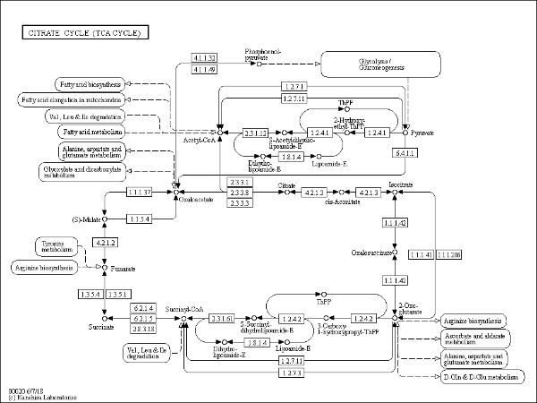
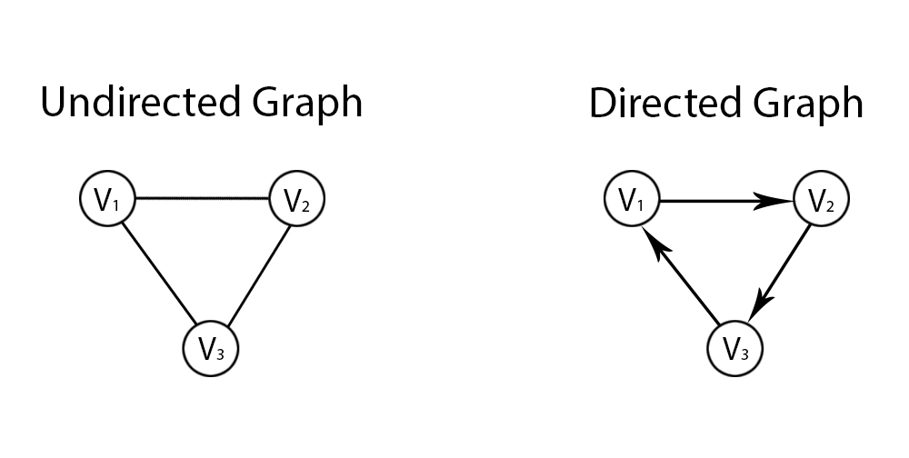
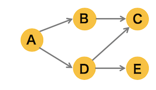
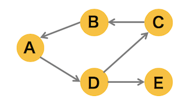
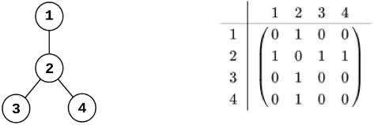
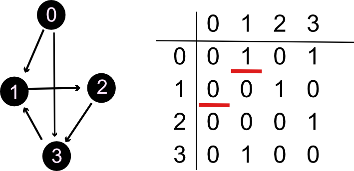
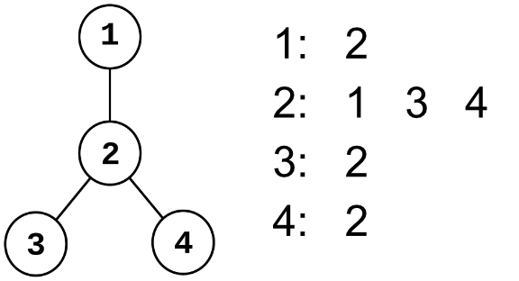
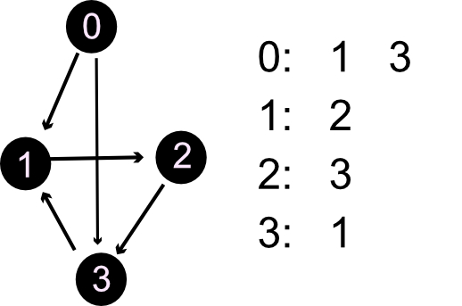
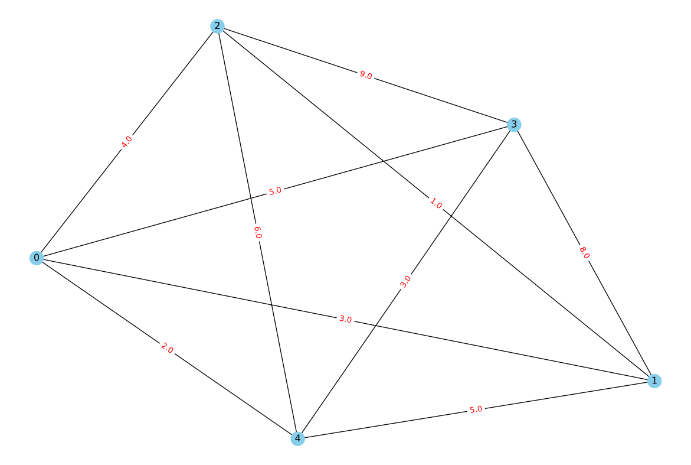

#+TITLE: ネットワーク(グラフ)の基礎
#+AUTHOR: 曹　巍
#+DATE: July 15, 2020
#+OPTIONS: toc:nil reveal_global_footer:t
#+REVEAL_ROOT: https://cdn.jsdelivr.net/npm/reveal.js
#+REVEAL_MATHJAX_URL: https://cdn.jsdelivr.net/npm/mathjax@3/es5/tex-svg.js
#+REVEAL_THEME: moon
#+REVEAL_INIT_OPTIONS: width:1200, height:800,
#+REVEAL_INIT_OPTIONS: margin: 0.04, minScale:0.2, maxScale:2.0, center:'false',
#+REVEAL_INIT_OPTIONS: slideNumber:'c/t', 
#+REVEAL_INIT_OPTIONS: menu: {side: 'left', titleSelector: 'h1, h2, h3, h4', markers: true, custom: false, themes: true, transitions: true, openButton: true, openSlideNumber: false, keyboard: true, sticky: false, autoOpen: true}
#+REVEAL_HEAD_PREAMBLE: <meta name="description" content="Introduction of network analysis.">
#+REVEAL_POSTAMBLE: 
 Created by 曹巍. 

#+REVEAL_PLUGINS: (highlight markdown notes)
#+REVEAL_EXTRA_CSS: https://maxcdn.bootstrapcdn.com/font-awesome/4.5.0/css/font-awesome.min.css
# +REVEAL_PREAMBLE: 

農研機構

# +REVEAL_HLEVEL: 
# +REVEAL: split
# +REVEAL_TITLE_SLIDE: %t \n %a \n %d \n %%
# +REVEAL_SLIDE_HEADER: reveal_global_header:t 
# +REVEAL_SLIDE_FOOTER: 農研機構,NARO
#+MACRO: color @@html:$2@@

* グラフ（ネットワーク）
  
** ネットワークの役割

*** タンパク質相互作用ネットワーク

[[./pics/prInter.png]]

*** 代謝ネットワーク(TCA)

*** インターネットマップ (The Opte Porject, 2005)

#+ATTR_HTML: :width 200px
#+ATTR_LATEX: :width 200px
#+ATTR_ORG: :width 80px 

[[./pics/internet.png]]

** ネットワークをモデリングは{{{color(red,なぜ)}}}

- ネットワークモデルの構造  
  - Erdos-Renyi random graph
  - Watter-Strogatz small world model
  - Barabasi-Albert scale-free networks

- 動的な意義

  - 疾病や情報の拡散
  - ソーシャルネットワーク
  - 遺伝子発現情報
  - ... ...

* ネットワークの用語 

** "ネットワーク" $\equiv$ "グラフ"
  
 | 領域                    | 点             | 線              |
 |----------------------- +----------------+----------------- |
 | 数学                   | 頂点(vertices) | 辺(edges,arcs)  |
 | コンピュータサイエンス   | 節点(nodes)    | リンク(links)   |
 | 物理学                 | サイト(sites)  | ボンド(bonds)   |
 | 社会学                 | actors         | ties, relations |
  
** 例: Random network and Scale-free network
  
    [[./pics/networks.jpg]]

** 有向グラフ(Directed graph)と無向グラフ(undirected graph)

    

** 有向グラフ: 非巡回と巡回 (Acyclic and cyclic graph)
#+REVEAL_HTML: 

有向非巡回グラフ
  
    
#+REVEAL_HTML: 

#+REVEAL_HTML: 

有向巡回グラフ
    
    
#+REVEAL_HTML: 

** グラフの表現：隣接行列(Adjacency matrix)
#+REVEAL_HTML: 

隣接行列: 無向グラフ 

#+REVEAL_HTML: 

#+REVEAL_HTML: 

隣接行列: 有向グラフ

#+REVEAL_HTML: 

** グラフの表現：隣接リスト (Adjacency list)
#+REVEAL_HTML: 

隣接リスト: 無向グラフ 

#+REVEAL_HTML: 

#+REVEAL_HTML: 

隣接リスト: 有向グラフ

#+REVEAL_HTML: 

* ネットワークの構築

** 頂点間の距離

頂点Aと頂点Bがどのぐらい離れることによって
頂点Aと頂点Bの間に辺をつけます。いわゆる、{{{color(red, 辺)}}}が頂点間の距離による定義します。
次は、よく使う距離の定義を紹介します。

** 都市ブロック距離 (City Block Distance)

$$d = \sum_{i=1}^{k} |a_{i} - b_{i}|$$

**Note**:　City Block distanceは $d \ge 0$, マンハッタン(Manhattan distance)距離とも呼ばれます.

#+BEGIN_NOTES
In most cases, this distance measure yields results similar to the Euclidean distance. 
Note, however, that with City block distance, the effect of a large difference in 
a single dimension is dampened (since the distances are not squared).

The name City block distance (also referred to as Manhattan distance) is explained 
if you consider two points in the xy-plane. The shortest distance between the two points 
is along the hypotenuse, which is the Euclidean distance. 
The City block distance is instead calculated as the distance in x plus the distance in y, 
which is similar to the way you move in a city (like Manhattan) where you have to move 
around the buildings instead of going straight through.
#+END_NOTES

** ユークリッド距離 (Euclidean Distance)
k次元の点aと点bの間のユークリッド距離は次の式で計算する。

$$d = \sqrt{\sum_{i=1}^{k} (a_{i} - b_{i})^2}$$

***Note***: ユークリッド距離は $d \ge 0$

#+BEGIN_NOTES
The Euclidean distance between two points, a and b, with k dimensions is calculated as shown.
The Euclidean distance is always greater than or equal to zero. 
The measurement would be zero for identical points and high for points that show little similarity.
#+END_NOTES

** 平方ユークリッド距離 Squared Euclidean Distance

k次元の点aと点bの間の平方ユークリッド距離は次の式で計算する。

$$d = \sum_{i=1}^{k} (a_{i} - b_{i})^2$$

** Half Squared Eculidean Distance

$$d = \frac{1}{2}\sum_{i=1}^{k} (a_{i} - b_{i})^2$$

** Pearson’s相関係数(Correlation coefficient)
k次元の点Aと点Bの相関は、以下の計算式で計算する。
$$d = \frac{cov(A, B)}{\sigma_A\sigma_B} $$

***Note***: 相関係数は無次元量で、−1以上1以下の実数に値をとる。

** Cosine Correlation
k次元の点Aと点Bの相関は、以下の計算式で計算する。
$$ d = \frac{A\cdot B}{||A||||B||} = \frac{\sum_{i=1}^{k}A_i B_i}{\sqrt{\sum_{i=1}^{k}A_{i}^{2}}\sqrt{\sum_{i=1}^{k}B_{i}^{2}}}$$

***Note***: Cosine Correlationの範囲が−１から+1まで (+１はaとbの類似度が一番高いと示す).

** Tanimoto係数(Tanimoto Coefficient)
k次元の点Aと点Bの相関は、以下の計算式で計算する。
$$ T_s = \frac{\sum_{i}(A_i \bigwedge B_i)}{\sum_{i}(A_i \bigvee B_i)} $$
$$d = -log_{2}(T_s)$$ 
相同性がnon-zeroの場合, ここでの$\bigwedge$ と $\bigvee$ はbitwiseのand, orの操作です。

***Note***: Tanimoto係数はJaccard係数の拡張バーションです。バイナリーの場合、Jaccard係数になって
範囲が0から+1まで (+１はaとbの類似度が一番高いと示す).

#+BEGIN_NOTES
$$d = \frac{\sum_{i=1}^{k}a_i\times b_i}{\sum_{i=1}^{k}a_{i}^2 + \sum_{i=1}^{k}b_{i}^2 - \sum_{i=1}^{k}a_i\times b_i}$$
#+END_NOTES

** Tanimoto係数(Jaccard係数の拡張バージョン)の例

A = ["リンゴ","ブドウ","イチゴ","パイン","キウイ","メロン"]  

B = ["メロン","イチゴ","リンゴ","パインアップル"] 

全部の種類で、"リンゴ","ブドウ","イチゴ","パイン","キウイ","メロン","パインアップル"を用いて、
AとBをベクトル化する。

** Tanimoto係数とJaccard係数の例 - Con't

AとBの長さは、 

\begin{aligned}
\|A\|^{2} &= 1^{2} + 1^{2} + 1^{2} + 1^{2} + 1^{2} + 1^{2} + 0^{2} = 6 \\
\|B\|^{2} &= 1^{2} + 0^{2} + 1^{2} + 0^{2} + 0^{2} + 1^{2} + 1^{2} = 4  
\end{aligned}

** Tanimoto係数とJaccard係数の例 - Con't

Tanimoto係数：　

\begin{aligned}
 T(A, B) &= \frac{A\cdot B}{\|A\|^{2} + \|B\|^{2} - A\cdot B} \\
         &= \frac{3}{6+4-3} \\
         &= \frac{3}{7} 
\end{aligned}

Jaccard係数: $A \cap B = 3$ と $A\cup B = 7$  

$$J = \frac{ A\cap B}{A\cup B } = \frac{3}{7} $$

** データからネットワークの構築　
$$d = \sum_{i=1}^{k} |a_{i} - b_{i}|$$
#+REVEAL_HTML: 

　ノードのデータ
#+ATTR_HTML: :style font-size:26px;
| Node id | attribute |
|---------+-----------|
|       1 |         5 |
|       2 |         2 |
|       3 |         1 |
|       4 |        10 |
|       5 |         7 |

#+REVEAL_HTML: 

#+REVEAL_HTML: 

   距離行列：(City block distance)
#+ATTR_HTML: :style font-size:20px;
|        | Node 1 | Node 2 | Node 3 | Node 4 | Node 5 |
|--------+--------+--------+--------+--------+--------|
| Node 1 |      0 |      3 |      4 |      5 |      2 |
| Node 2 |      3 |      0 |      1 |      8 |      5 |
| Node 3 |      4 |      1 |      0 |      9 |      6 |
| Node 4 |      5 |      8 |      9 |      0 |      3 |
| Node 5 |      2 |      5 |      6 |      3 |      0 |

#+REVEAL_HTML: 

** 距離行列からネットワークの構築
#+REVEAL_HTML: 

   距離行列：(City block distance)
#+ATTR_HTML: :style font-size:20px;
|        | Node 1 | Node 2 | Node 3 | Node 4 | Node 5 |
|--------+--------+--------+--------+--------+--------|
| Node 1 |      0 |      3 |      4 |      5 |      2 |
| Node 2 |      3 |      0 |      1 |      8 |      5 |
| Node 3 |      4 |      1 |      0 |      9 |      6 |
| Node 4 |      5 |      8 |      9 |      0 |      3 |
| Node 5 |      2 |      5 |      6 |      3 |      0 |
#+REVEAL_HTML: 

#+REVEAL_HTML: 

#+REVEAL_HTML: 

* ネットワークの解析 (undirected graph)
#+OPTIONS: toc:nil
#+TOC: headlines 1 local

** クラスター係数
1. Global cluster coefficient 

Alternative: Network average clustering coefficient

2. Local cluster coefficient

** 平均ノード間距離
** ネットワーク半径
** ネットワークの比較
** ネットワークの分割
  Prize Collecting Steiner Forest(PCSF) algorithm to identify high confidence subnetwork 
  relevant to the context.

* ネットワークの可視化

** Cytoscape

* 遺伝子発現によるネットワーク構築

