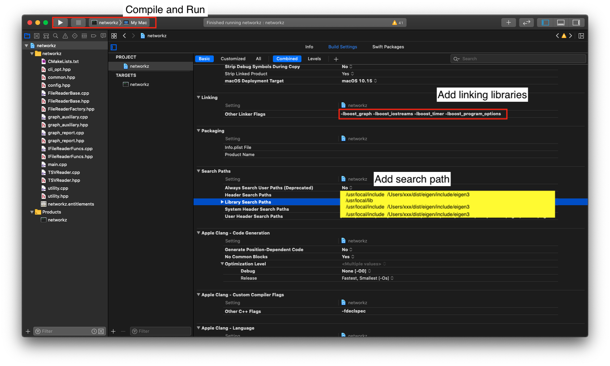
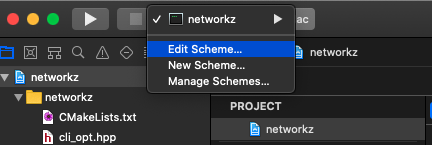
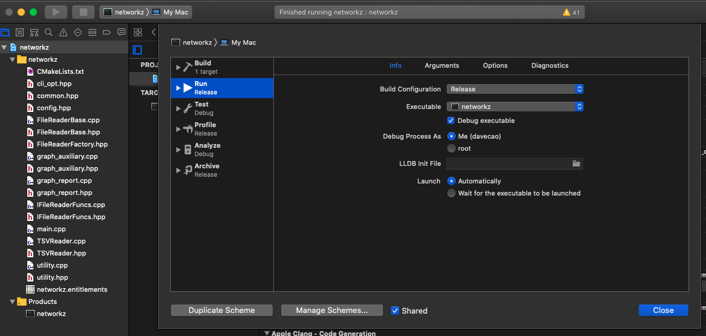
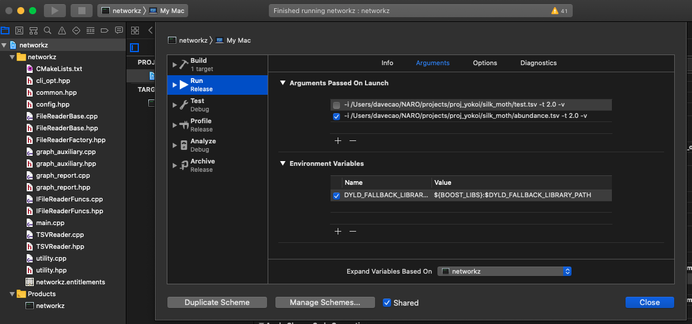

#  Networkz

## Prerequisites

1. cmake (xcode project also provided)
2. Boost Graph Library (version 1.70 or later)
3. Eigen (version 3.3.9 or later)
4. C++ compiler (support c++17, clang 9.0 had been tested on MacOS) 

## For MacOS 10.15

### Install Homebrew

1. Install homebrew

        /bin/bash -c "$(curl -fsSL https://raw.githubusercontent.com/Homebrew/install/master/install.sh)"

2. Check the availability of `brew` command

        brew -v  
    
        Homebrew 2.4.9. 
        Homebrew/homebrew-core (git revision 4dd70; last commit 2020-08-04). 
        Homebrew/homebrew-cask (git revision d77724; last commit 2020-08-04). 

### Install CMake by `brew`

    brew install cmake

### Install C++ compiler (Xcode)

1. Open Apple store by clicking the following URL

https://apps.apple.com/jp/app/xcode/id497799835?mt=12
   
2. Install xcode command line tools from a terminal

        sudo xcode-select --install

3. Check the availability of clang compiler from the terminnal

        cc --version

You should find the similar info as follows,

   Apple clang version 11.0.3 (clang-1103.0.32.62). 
   Target: x86_64-apple-darwin19.6.0. 
   Thread model: posix. 
   InstalledDir: /Applications/Xcode.app/Contents/Developer/Toolchains/XcodeDefault.xctoolchain/usr/bin. 

### Install the dependencies by Homebrew

1. Install Boost Libraries

        brew install boost

2. Install Eigens manually

>>Note: Eigen3 version is 3.3.7 which is lower than the requirement.

2.1 Create a fold to store the source code, e.g., `apps` in the home directory

    mkdir $HOME/{apps,dist}; cd $HOME/apps

2.2 Download the source code by `git`  

    git clone https://gitlab.com/libeigen/eigen.git

2.3 Install the code with CMake

    mkdir build; cd build
    cmake -DCMAKE_INSTALL_PREFIX=$HOME/dist/eigen -DCMAKE_BUILD_TYPE=Release ../
    make install

2.4 Add the eigen3 to the include path to your start shell.

    export EIGEN3_INCLUDE_DIR=$HOME/dist/eigen/include/eigen3

## Download the soure code from github

    cd $HOME/apps/
    git clone https://github.com/davecao/networkz.git

## Compile Networkz

Compile the source code by `CMake` or `Xcode` on MacOS

### Compilation by CMake

    mkdir build; cd build
    cmake -DCMAKE_BUILD_TYPE=Release ../path/to/networkz
    make VERBOSE=1

The executable file will be generated in the *build* directory.

### Compilation by Xcode

   Open the xcode project file, `networkz.xcodeproj`, by double click.  
   Choose the scheme to compile the source code.  
 
##### Configure the xcode setting

## Format of Input file

Tab-Separated Values (TSV) format is only supported now.
